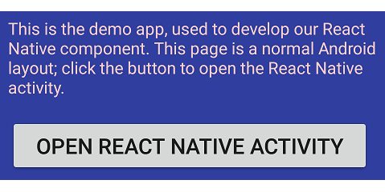
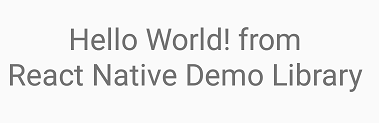

# react-europe-demo

Demo app for React Europe lightning talk (Paris, May 2017), showing how to create reusable react-native components that can be consumed by existing Android applications that don't want to take a dependency on **npm** and associated infrastructure.

## Getting started

### Windows

* [Install Git](https://git-scm.com/downloads)
* [Install Node.js](https://nodejs.org/en/download/)
* Install [Android Studio](https://developer.android.com/studio/install.html), following instructions on the React Native [Getting Started](https://facebook.github.io/react-native/docs/getting-started.html) page.
* From a shell with Node and Git in the path:
  * `git clone https://github.com/petterh/react-europe-demo.git` in the folder where you want the repository
  * `cd react-europe-demo\DemoApp\reactnativedemolibrary`
  * `npm install` (creates a `node_modules` folder)
* Open `react-europe-demo\DemoApp` in Android Studio
* Build and run the `app` module (debug, for now &ndash; emulator or device doesn't matter). You should see something like this:\
  
* From a shell with Node and Git in the path, start the development server:
  * `cd react-europe-demo\DemoApp\reactnativedemolibrary`
  * `react-native start`
* Click the **Open React Native Activity** button. You should see something like this:\
  

### macOS

* [Install Homebrew](https://brew.sh/)
* Install Node: `brew install node watchman`
* Install React Native CLI: `npm install -g react-native-cli`
* Clone the repo: `git clone https://github.com/petterh/react-europe-demo.git`
* Install npm packages:

```bash
cd react-europe-demo\DemoApp\reactnativedemolibrary
npm install
```

* Open the Xcode project `iOSHostApp/iOSHostApp.xcodeproj`
* Make sure `iOSHostApp` scheme is selected, then click on build and run

The React Native watcher should automatically start before the app does. The app should look something like this:


**Note:** The host app currently can only be run in the simulator because it is hardcoded to load JavaScript from localhost.

## The code

This repository is structured as follows:

```
react-europe-demo
  |
  +-- DemoApp
  |     |
  |     +-- app
  |     |
  |     +-- reactnativedemolibrary
  |
  +-- Artifacts
  |
  +-- HostApp1
  |
  +-- HostApp2
  :
  |
  +-- HostApp_n
  |
  +-- iOSHostApp
        |
        +-- ReactFramework
        |
        +-- iOSHostApp
        |
        +-- iOSHostApp.xcodeproj
```

**DemoApp** is an Android Studio project with two modules:

* **app**: A test-bed application that depends on the **reactnativedemolibrary** module. This module isn't strictly necessary, but a great convenience.
* **reactnativedemolibrary**: A react-native library with some JavaScript and a Java native module. (TODO: Add a resource as well, such as an image.)
  * The JavaScript bundle;
  * any other assets, such as images;
  * a Maven POM holding the **reactnativedemolibrary** code;
  * a Maven POM holding the **react-native** code.

**Artifacts** contains **reactnativedemolibrary** artifacts:

**HostApp1** shows the `HelloWorld` JavaScript component in its own activity, just like **DemoApp**.

**HostApp2** shows the `HelloWorld` JavaScript component hosted within a normal Android layout.

**iOSHostApp** is where the iOS app lives:

* **ReactFramework**: React Native library with a demo native module.
* **iOSHostApp**: Host app that embeds **ReactFramework**.
* **iOSHostApp.xcodeproj**: Xcode project for building both the framework and the host app.

## Creating artifacts

The demo app links in `react-native` via `reactnativedemolibrary`. In **Getting started** above, the JavaScript isn't bundled with the apk, but loaded from the dev server.

* For production, the JavaScript must be bundled into the apk, done via the `react-native bundle` command.
* We also need to pack up our code into something a host app can consume. For this we utilize a Gradle plugin called `maven-publish` to create a POM. [Source](http://stackoverflow.com/questions/34872382/manually-adding-aar-with-dependency-pom-iml-file)
* Finally, we need to package `react-native` for host app consumption. Look for `copyReactNativeTask` in `reactnativedemolibrary/build.gradle`.

All three steps are invoked by the script `create-artifacts.cmd`. Run it from `react-europe-demo\DemoApp`to generate something like this:

```
react-europe-demo/Artifacts
  |
  +-- assets
  |     |
  |     +-- index.android.bundle
  |     +-- (additional non-essential files -- haven't gotten map to work (TODO))
  |
  +-- maven
  |     |
  |     +-- com
  |           +-- contoso
  |           |     |
  |           |     +-- react
  |           |           +-- reactnativedemolibrary
  |           |                 +-- 0.1
  |           |                 |     +-- reactnativedemolibrary-0.1.aar
  |           |                 |     +-- reactnativedemolibrary-0.1.pom
  |           |                 |     +-- (additional files)
  |           |                 +-- maven-metadata.xml
  |           |                 +-- (additional files)
  |           +-- facebook
  |           |     |
  |                 +-- react
  |                       +-- reactnativedemolibrary
  |                             +-- 0.44.0
  |                             |     +-- react-native-0.44.0.aar
  |                             |     +-- react-native-0.44.0.pom
  |                             |     +-- react-native-0.44.0-javadoc.jar
  |                             |     +-- react-native-0.44.0-sources.jar
  |                             |     +-- (additional files)
  |                             +-- maven-metadata.xml
  |                             +-- (additional files)
  +-- res (not yet used; intended for images)
```

Why do we package the `react-native` we got from **npm** into `Artifacts/maven`? After all, `react-native` *is* available from maven jcenter. The version is, however, quite old. There's an ongoing discussion whether to update it whenever a new version is released, or to remove it altogether. Either one is fine by me, but the current situation is just asking for trouble:

* [React-Native Maven is no longer actively updated with releases](https://github.com/facebook/react-native/issues/6459)
* [Remove react-native package from maven central and jcenter](https://github.com/facebook/react-native/issues/13094)

In other words, we really can't use the one currently available from jcenter. Bundling it ourselves has the added benefit of ensuring version consistency between react-native and our JavaScript code.

## Consuming `reactnativedemolibrary` from host apps

You need to

* reference `reactnativedemolibrary`;
* tweak `build.gradle` to include the JS assets;
* add a new `Activity`;
* potentially ensure you don't generate an .apk referencing 64-bit libraries.

Once that's done, you can just run the host app, and everything should work.

### Referencing `reactnativedemolibrary` and (indirectly) `react-native` from Gradle

Add a maven url `build.gradle`, pointing it to wherever your artifacts reside:

```gradle
allprojects {
    repositories {
        jcenter()
        ...
        maven {
            // Get reactnativedemolibrary and react-native from here
            url "$rootDir/../Artifacts/maven"
        }
    }
}

```

### Including assets (the JavaScript bundle, for now, but we'll do images (promise!))

While copying the JS bundle manually is always an option, getting Gradle to do it for you is better:

```gradle
task copyAssets(type: Copy) {
    from "$rootDir/../Artifacts/assets"
    into "src/main/assets"
}

afterEvaluate {
    android.applicationVariants.all { variant ->
        variant.javaCompiler.dependsOn(copyAssets)
    }
}
```

Sources:

* [Run task before compilation using Android Gradle plugin](http://stackoverflow.com/a/36334186/3968276)
* [Gradle `Copy` class](https://docs.gradle.org/3.4/javadoc/org/gradle/api/tasks/Copy.html)

### Java code changes

Create an `Activity` to host the react-native view:

```java
public class ReactActivity1 extends AppCompatActivity {

    @Override
    protected void onCreate(Bundle savedInstanceState) {
        super.onCreate(savedInstanceState);
        View view = ReactNativeDemoLibrary.start(this, false);
        setContentView(view);
    }
}
```

Host app #2 displays the `HelloWorld` component alongside other Android `View`s.

## 32-bit vs. 64-bit

[React Native doesn't currently support 64-bit native (C/C++) modules](https://corbt.com/posts/2015/09/18/mixing-32-and-64bit-dependencies-in-android.html). To avoid problems, any host app *may* need to add something like this to `build.gradle`:

```gradle
android {
    ...
    defaultConfig {
        ...
        ndk {
            abiFilters "armeabi-v7a", "x86"
        }
    }
}
```
